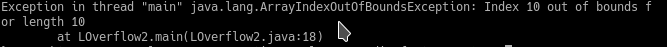
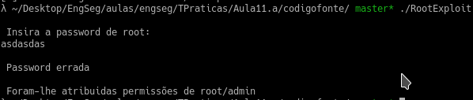

# TP8- Resolução

### Pergunta P1.1

O programa LOverflow2 tem como finalidade criar um array com o tamanho e os números escolhidos pelo utilizador.
Quando o programa é escrito em java vemos que lança um erro quando o número ultrapassa o tamanho do array. Para qualquer outro caso funciona como esperado, não permite um input que não seja um número.

Quando o programa é escrito em python vemos que conseguimos escrever sempre count-1 números, ou seja, se dissermos que queremos escrever 3 números apenas conseguimos escrever 2. Também é possível escrever outra coisa que não seja um número como demonstra a imagem abaixo:

![]](./images/python.png)

Se o número ultrapassar o número de posições que o array aguenta então é lançado um erro:

No caso do c++ mesmo que dissermos que queremos 12 números o programa continua a correr como mostra a imagem abaixo:

Caso o número introduzido seja demasiado grande o programa lança um erro (segmentation fault) parando a sua execução:

### Pergunta P1.2

Quando o programa é escrito em java não é possível aceder a dados externos levantando um erro sempre que se tenta obter um valor fora dos valores guardados no array:

O caso do python é semelhante ao do java também levantando um erro quando é feito um acesso fora do array

Quando o programa é escrito em c++ é possível aceder valores do array a que não deveriamos ter acesso, por exemplo, se dissermos que queremos guardar no array 10 valores e tentarmos recuperar o valor 20 não deveria ser possível, mas como mostra a image, o programa retorna um valor:

### Pergunta P1.3

Olhando para o programa RootExploit é possível ver que conseguimos encher o buffer inserindo apenas 4 valores, e se depois inserirmos outro qualquer valor conseguimos entrar na parte do programa que nos atribui permissões de root/admin como mostra a imagem:

O programa 0-simple.c é semelhante mas são necessários muitos mais valores para preencher o buffer (64). A imagem a seguir mostra os dois endereços das variáveis buffer e control o que permite saber quantos bytes são necessários para conseguirmos aceder a parte do programa que imprime "YOU WIN!!!!\n"

### Pergunta P1.4

Olhando para o programa é possível ver que no seu funcionamento normal o programa pega no primeiro input do utilizador que decide quantos caratéres irão ser lidos de uma frase que irá também ser introduzida por este. Um caso problemático é quando o utilizador pede para ler um valor alto (8000) e não introduz nenhuma frase o que faz com que o programa leia informações relativas ao sistema como mostra a imagem :

### Pergunta P1.5

O objetivo desta pergunta é alterar a variável de controlo (control) de forma a esta possuir o valor 0x61626364. Em primeiro lugar começou-se por encher o buffer até aparecer algum tipo de mudança na variável de controlo. Quando se viu a variável a mudar de valor foi necessário descobrir quais os valores que permitissem chegar ao valor pedido. Em hexadecimal os valores 61,62,63 e 64 correspondem a 'a','b','c' e 'd' respetivamente. Se colocarmos o valor 'abcd' vamos obter o valor 0x64636261 devido à máquina ser little-endian. Para obter o valor certo basta inverter esse valor introduzindo então 'dcba'.

### Pergunta P2.1

A vulnerabilidade da função vulneravel() deve-se ao overflow inteiros. A função vulneravel() não efetua nenhuma verificação dos valores x e y, sendo que estes valores são utilizados para alocar o espaço que ocupa a matriz. Isto pode permitir ao programa escrever em locais de memória a que não tem acesso parando o programa. Completando a main da seguinte forma é possível mostrar que a função é vulnerável (x*y é superior ao valor máximo de um size_t)

### Pergunta P2.2

Neste caso a vulnerabilidade é um underflow. A verificação do tamanho que é passado como argumento à função vulnerável não cobre todos os casos. Apesar de testar se o tamanho não ultrapassa o MAX_SIZE para não causar um overflow o tamanho pode ser 0 e quando isso ocorre o valor da variável tamanho_real é -1 o que não permite que se aloque memória e que a função memcpy lance um erro

