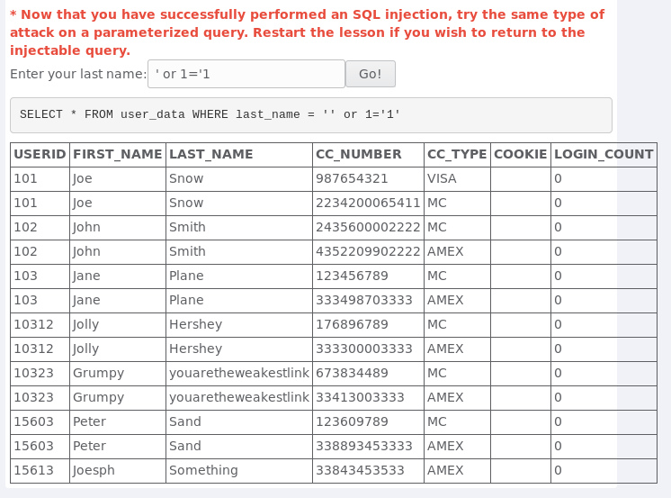
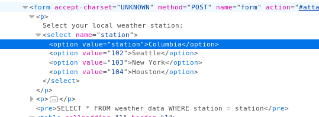
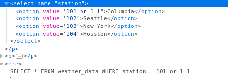
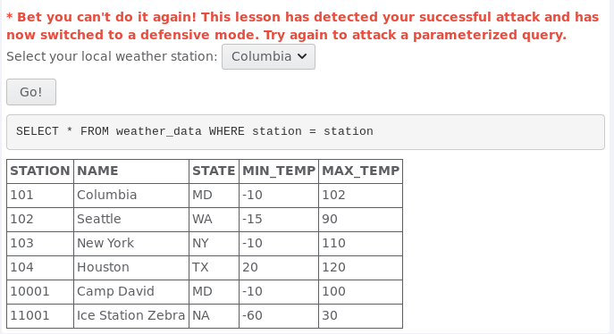
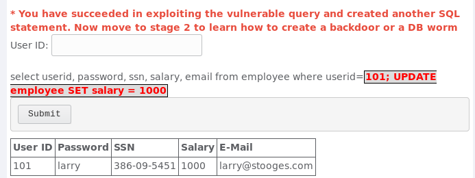
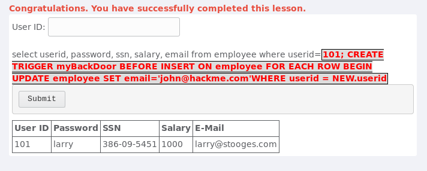
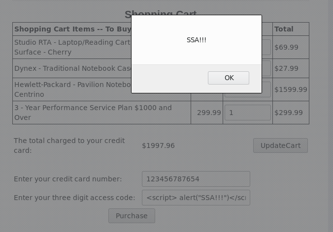
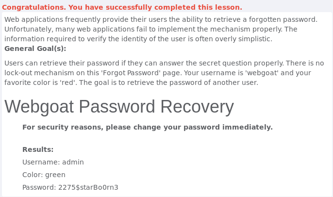

# TP9- Resolução

### Pergunta P1.1

Nesta pergunta o objetivo era executar um ataque de SQL Injection de forma a todos os dados da tabela user_data da base de dados aparecerem. Em primeiro lugar começou-se por testar como a base de dados se comportava introduzindo alguns nomes. A seguir introduziu-se o seguinte input ' or 1='1 o que fez com que o sistema realiza-se a query SELECT * FROM user_data WHERE last_name = '' or 1='1' . Esta query vai ser sempre verdadeira e vai retornar todos os dados presentes na tabela user_data como mostra a imagem abaixo




### Pergunta P1.2

O objetivo desta pergunta é semelhante ao anterior, usar uma SQL Injection de forma a todos os dados meteorológicos serem apresentados. A diferença aqui é que não podemos introduzir uma string. Em primeiro lugar começamos por abrir o Inspector do Firefox e localizar onde se encontravam os valores das diferentes stations. A seguir temos duas opções (ambas criam tautologias) ou alteramos o value da opção Columbia para o valor "station" de forma a obter a seguinte query SELECT * FROM weather_data WHERE station = station ou alteramos o value da opção Columbia para o valor "101 or 1=1" obtendo a query SELECT * FROM weather_data WHERE station = 101 or 1=1. De ambas as formas obtemos todos os valores presentes nas tabelas







### Pergunta P1.3

Na primeira parte desta pergunta o objetivo é executar mais que um comando SQL, para uma conta com o ID 101. Após ver o que o sistema respondia quando introduzido o ID válido 101 tentamos introduzir um comando UPDATE. Os comandos em SQL são normalmente separados por um ";" como tal para introduzirmos o segundo comando bastou introduzir a seguinte string "101; UPDATE employee SET salary = 1000" obtendo o seguinte resultado:




Na segunda fase desta pergunta tinha como objetivo introduzir uma backdoor na base de dados. Para isso foi utilizado um Trigger que estava descrito na descrição do exercício do WebGoat. Como a base de dados não suporta Triggers não é possível ver os resultados deste statement mas podemos prever o que aconteceria. Por cada Insert feito na tabela employee em cada linha é feito um statement UPDATE que vai alterar o email para "john@hackme.com" onde o userid é o novo userid gerado.



### Pergunta P2.1

Nesta pergunta o objetivo é executar um ataque de Reflected XSS (Cross-Site Scripting). Por tentativa e erro, descobriu-se que o campo que aceita os 3 digitos do cartão é vulnerável a este tipo de ataque e como tal, se introduzirmos o seguinte 
script: 

```
    <script> alert("SSA!!!")</script> 
``` 

Obtemos o seguinte alerta:



### Pergunta P3.1

Esta pergunta tem como objetivo descobrir a password de outro utilizador do sistema. Numa fase inicial foi feito um teste para ver como o sistema se comportava introduzindo o nosso utilizador "webgoat" e a cor "red" para responder à pergunta de segurança, é possível errar quantas vezes quisermos ao responder a esta pergunta, o que nos permite  realizar um ataque de brute force para descobrir a cor de outro utilizador. Como o utilizador mais importante do sistema é o admin colocamos "admin" como utilizador, a seguir basta tentar adivinhar qual a cor preferida deste introduzindo varias cores diferentes até obtermos a resposta certa:

